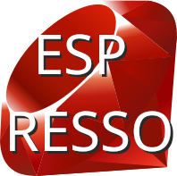

<div align="center">
    
# ☕ Espresso

A tiny embedded scripting language + bytecode VM for ESP32


### Minimal scripting runtime for microcontrollers

### Note: this language is heavily inspired by Ruby

</div>

## Example

```ruby
def blink(delay)
    lvl = 1
    while 1==1
        gpio 2 1
        sleep delay

        gpio 2 0
        sleep delay

        lvl = lvl + 1
        puts lvl
    end
end

blink(100)
```
